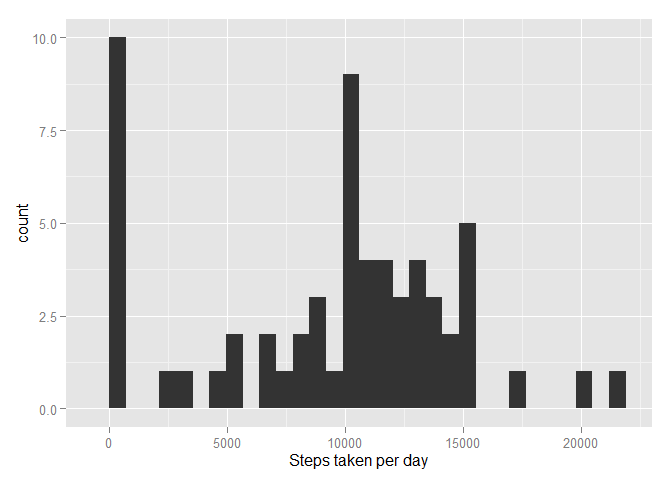
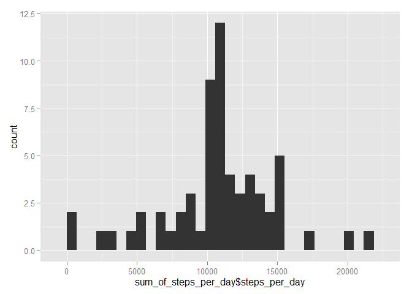
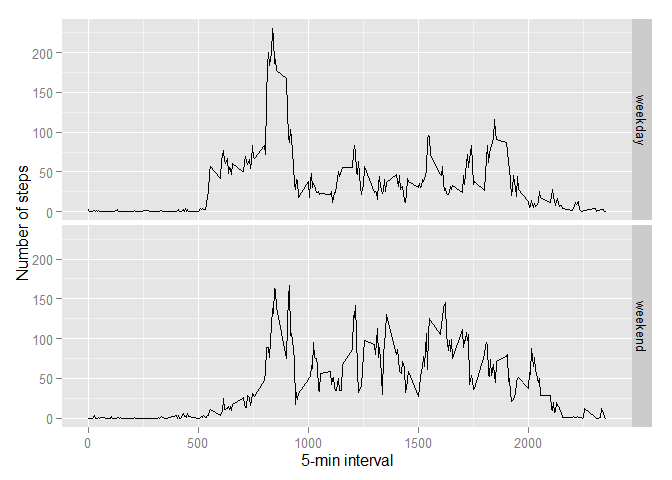

# Reproducible Research: Peer Assessment 1


## Loading and preprocessing the data
* Download dataset from server

```r
# Check if we have data directory, create if not
if (!file.exists("data")) {
  dir.create("data")
}

# Download dataset if not laready loaded
if (!file.exists("./data/dataset.zip")) {
  
  fileUrlCsv = "https://d396qusza40orc.cloudfront.net/repdata%2Fdata%2Factivity.zip"
  download.file(fileUrlCsv, destfile="./data/dataset.zip")
}
```
* Unzip it

```r
# Unzip dataset
unzip("./data/dataset.zip", exdir = "./data")
```
* Read the csv-file to data variable

```r
activity_data <- read.csv("./data/activity.csv")
```


## What is mean total number of steps taken per day?

* use dplyr and ggplot2 libraries


```r
library(dplyr)
library(ggplot2)
```
* Total number of steps taken per day


```r
sum_of_steps_per_day = activity_data %>%
  group_by(date) %>%
  summarise(steps_per_day = sum(steps, na.rm = TRUE))

qplot(steps_per_day, data = sum_of_steps_per_day, geom = "histogram", xlab = "Steps taken per day")
```

 


* Calculate and report the mean and median of the total number of steps taken per day

```r
mean_steps_day = mean(sum_of_steps_per_day$steps_per_day)
median_steps_day = median(sum_of_steps_per_day$steps_per_day)
```
Mean of total number of steps taken per day is: 9354.2295082
Median of total number of steps taken per day is: 10395


## What is the average daily activity pattern?

* Calculate average steps per 5-min interval from all days

```r
# Group by interval
average_steps_per_interval = activity_data %>%
  group_by(interval) %>%
  summarise(steps_per_interval = mean(steps, na.rm = TRUE))

#Plot the average steps per interval

qplot(average_steps_per_interval$interval, average_steps_per_interval$steps_per_interval, geom="line", xlab = "5-minute interval", ylab = "Average number of steps taken")
```

 

* Find the interval, which has most steps

```r
max_index = which(average_steps_per_interval$steps_per_interval == max(average_steps_per_interval$steps_per_interval))
max_interval = average_steps_per_interval$interval[max_index]
```

Which 5-minute interval, on average accross all the days in the dataset, contains the maximum number of steps?: 835  
Probable reason is people go to work at that time.


## Imputing missing values

* Calculate and report the total number of missing values in the dataset

```r
nas = activity_data %>%
  filter(is.na(activity_data$steps))
  
missing_values = dim(nas)[1]
```
Total number of missing values is: 2304

* Device a strategy for filling all of the missing values:
Replace NA with the median of the 5-min interval

```r
# Function to replace NA's with average values
fill.value <- function(steps, interval) {
  filled <- NA
  if (is.na(steps))
    filled <- average_steps_per_interval$steps_per_interval[average_steps_per_interval$interval == interval]
  else
    filled <- steps
    
  return(filled)
}

# Copy original data to new data frame and impute averages for NA's
filled_activity_data = data.frame(activity_data)
filled_activity_data$steps <- mapply(fill.value, filled_activity_data$steps, filled_activity_data$interval)
```
* Make histogram

```r
# Group by day
sum_of_steps_per_day = filled_activity_data %>%
  group_by(date) %>%
  summarise(steps_per_day = sum(steps))

# Plot histogram of total number of steps per day
qplot(sum_of_steps_per_day$steps_per_day, geom = "histogram")
```

 

* Calculate and report the mean and median of the toal number of steps taken per day

```r
mean_steps_day = mean(sum_of_steps_per_day$steps_per_day)
median_steps_day = median(sum_of_steps_per_day$steps_per_day)
```
Mean of total number of steps taken per day is: 1.0766189\times 10^{4}
Median of total number of steps taken per day is: 1.0766189\times 10^{4}

Values differ from the estimates from the first part of the assignment. Mean and median are higher. 
Impact of the strategy to distribute NA's as addition to intervals moves part of samples from zero to real 5-min intervals. So it is shifting mean and median.

## Are there differences in activity patterns between weekdays and weekends?

* Create new factors for data frame for weekday and weekend

```r
# Define function to classify the data as weekday or weekend
weekday_or_weekend <- function(date) {
  day = as.POSIXlt(date)$wday
  
  if (day == 0 | day == 6) {
    return("weekend")
  }
  else {
    return("weekday")
  }
}

part_of_week = factor(levels = c("weekday", "weekend"))

#Add part_of_week variable and init it with "weekday"
data_with_weekdays = mutate(filled_activity_data, part_of_week = "weekday")

#Use function to find which factor the date is
data_with_weekdays$part_of_week <- sapply(data_with_weekdays$date, FUN = weekday_or_weekend)

#Change part_of_week column to factor column
data_with_weekdays$part_of_week = as.factor(data_with_weekdays$part_of_week)
```
* Make a panel plot for weekdays and weekends about average number of steps taken in 5-min intervals

It seems people are generally moving more evenly in weekends and more often.

```r
# Group by part_of_week AND interval

average_intervals <- aggregate(steps ~ interval + part_of_week, data = data_with_weekdays, mean)

ggplot(average_intervals, aes(interval, steps)) + geom_line() + facet_grid(part_of_week ~.) + 
  xlab("5-min interval") + ylab("Number of steps")
```

 


